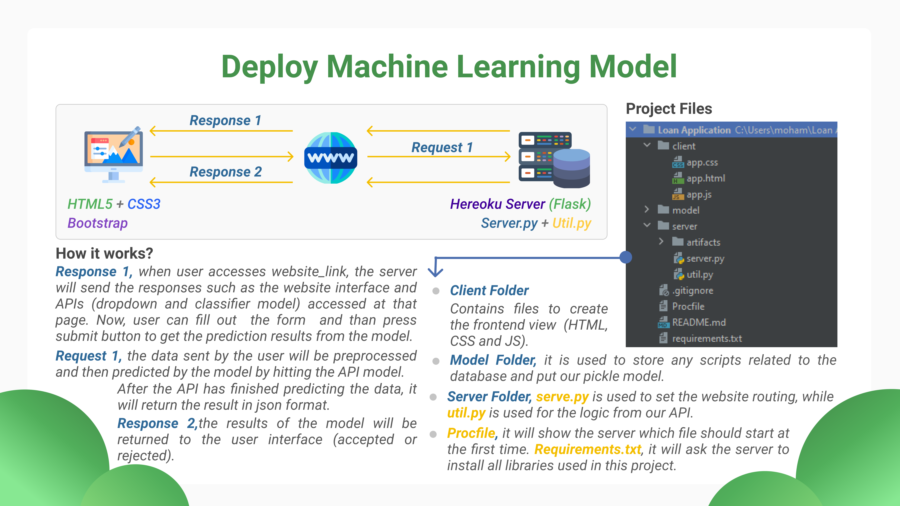
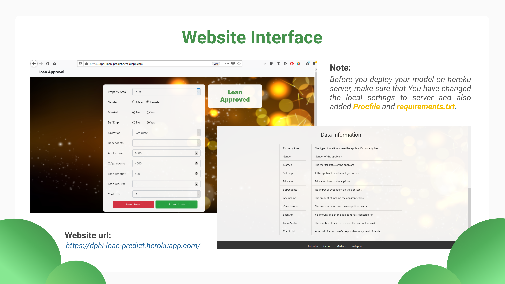

# Deploy Machine Learning Model on Heroku Server

<b><i>Model deployment</i></b> is all of the activities that make machine learning models available for consumption by many applications. Usually the machine learning model will be deployed to AWS, Google Cloud Platform, Azure Cloud, etc but that's certainly not free. One way to deploy the model freely is by using the <a href="https://www.heroku.com/">Heroku server</a>. This is an example repository of a machine learning model where it is connected to the Heroku server. The function of this model is to <b><i>predict whether a loan application will be accepted or rejected</i></b> by the bank. You can see the details from this repository below.
 

**Project Overview**

**Note**
<ol>
  <li>The firt thing you need to do to deploy your model is upload your project on github.</li>
  <li>Make sure there is already this file: <b><i>Procfile and requirements.txt</i></b>. Because without these two files, Heroku won't be able to read the application you want to deploy.</li>
  <li>You can start deploy your model using <a href='https://www.youtube.com/watch?v=mrExsjcvF4o&ab_channel=KrishNaik'>Heroku Website or Heroku Command Line</a></li>
  <li>If you find an error, try to check the <i>heroku log --tail</i>, solve the error and redeploy it.</li>
</ol>

#

**Project Result, <a href="https://dphi-loan-predict.herokuapp.com/"><i>Loan Approval Website</i></a>**

🎉 Yay, Start to deploy your own Machine Learning Model guys ...
